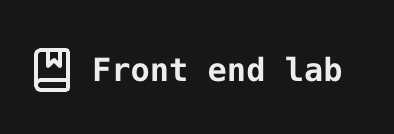

<h1 align="center">Frontend Lab</h1>

Frontend Lab é um repositório dedicado ao estudo e experimentação de tecnologias frontend modernas. Aqui você encontrará exemplos práticos, componentes reutilizáveis e boas práticas para desenvolver aplicações escaláveis e eficientes.

- Estrutura modular para estudos de frontend

- Exemplos práticos de Data Fetching

- Componentização eficiente com React

- Gerenciamento de estado otimizado

- Estilização flexível com Tailwind CSS

- Formulários dinâmicos com React Hook Form

- Acessibilidade e boas práticas de UI

## 🚀 Tecnologias Utilizadas

Next.js, React, React Hook Form, ShadCN, Tailwind CSS, R

